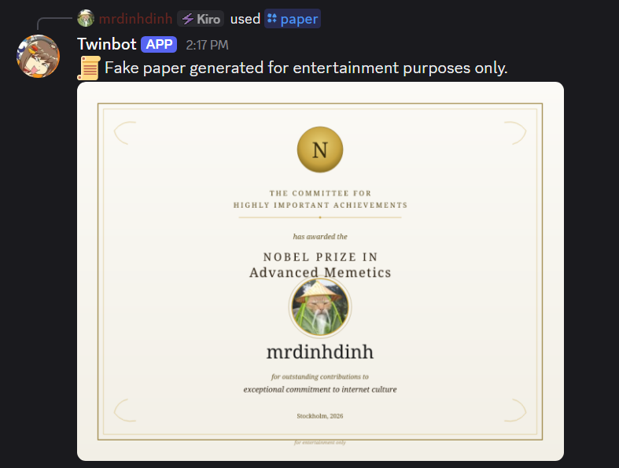
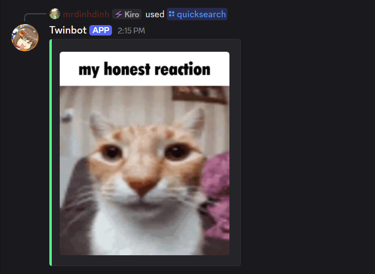

# 📜 Twinbot

A playful, free-to-host Discord bot that generates official-looking nonsense - and searches the web when you need it to actually be useful.




```
/paper type:nobel @charlie field:"Procrastination"
→ [bot posts a Nobel-style diploma: "for pioneering contributions to the field of doing it tomorrow"]


/paper type:marriage @alice @bob
→ [bot posts a fake marriage certificate with their avatars, gold seal, and "Official Seal of Questionable Decisions"]
```


```
/quicksearch query:"my honest reaction meme"
→ [bot posts an image result of the meme for you]
```

Everything runs on **Cloudflare Workers** — no server to rent, no daemon to babysit, free for most usage. Just deploy and go.

Optional add-ons (voice playback, persistent file storage, YouTube downloads) can be enabled later by attaching a small VPS. The bot works fine without it.

---

## ✨ What it does

**Parody papers** — Generate fake certificates that look official at a glance and contain obvious humor. Marriage, divorce, adoption, nobel, doctorate, friendship, employee of the month — each with its own template, colors, seals, and checkbox lists of absurd obligations.

**Quick search** — Text or image search from DuckDuckGo, right in Discord. Ephemeral can be toggled so your channel doesn't get spammed.

**Status control** — Toggle the bot between online/offline modes from Discord itself. Useful as a manual kill switch.

**Voice playback** *(optional, requires a VPS)* — Join voice channels, play local audio files, download from YouTube on demand.

**File management** *(optional, requires a VPS)* — List and upload files from a scoped download directory.

---

## 🚀 Quick start (Worker-only)

You'll need:
- A Discord application ([Developer Portal](https://discord.com/developers/applications))
- A Cloudflare account with Workers, Queues, and KV enabled

```bash
git clone https://github.com/FPTSTUDEN/twinbot
cd twinbot/worker

npm install -g wrangler
wrangler login

wrangler queues create discord-interactions
wrangler kv namespace create VPS_STATUS   # copy the id into wrangler.toml
wrangler secret put DISCORD_PUBLIC_KEY    # from the Discord Developer Portal

wrangler deploy
```

Then set your Worker URL as the app's **Interactions Endpoint URL** in the Discord Developer Portal. Discord sends a PING, the Worker replies with a PONG, and you're live.

That's it. No VPS. No Python. No daemon.

---

## 🎨 Paper templates

Templates are plain SVG files in `worker/templates/`. Each uses `{{placeholder}}` markers for the parts that change (names, avatars, dates, custom fields).

**Previewing:** open `worker/templates/preview.html` in a browser. You get live-editable fields — change the names, pick a paper type, watch the preview update. Drop two square PNGs named `avatar1.png` and `avatar2.png` into the folder to see avatars render.

**Adding a new type:**
1. Copy an existing `.svg`, adjust the layout.
2. Add it to `worker/templates/`.
3. Import it in `worker/papers.ts`, add it to the `TEMPLATES` map.
4. Register the choice in `bot.py` under `/paper`.

**Parody disclaimer:** Every generated document includes a "for entertainment only" footer. These are meant to be funny, not to fool anyone. Please don't use them to impersonate real institutions.

---

## 🏗️ How it works

The bot runs entirely on Cloudflare Workers by default. Discord sends slash commands to a Worker URL, the Worker verifies the signature, and replies inline. Stateless, fast, edge-deployed.

If you also want voice and file features, you attach an optional VPS. When the Worker sees a stateful command, it enqueues the payload to Cloudflare Queues and defers the interaction. The VPS polls the queue, runs the command, and posts the result back via Discord's followup webhook.

```
                    ┌────────────────────────┐
   /paper ───▶ │   Cloudflare Worker    │ ───▶ reply inline
   /quicksearch ──▶ │  (signature, routing)  │
                    └───────────┬────────────┘
                                │ enqueue stateful
                                ▼
                       ┌─────────────────┐
                       │ Cloudflare Queue│
                       └────────┬────────┘
                                │ pull
                                ▼
                       ┌─────────────────┐
                       │  VPS (optional) │ ───▶ followup webhook
                       │  voice, files   │
                       └─────────────────┘
```

**Why the split exists** — Discord only allows *one* Interactions Endpoint URL per application, and voice streaming requires a persistent connection that Workers can't provide. The Worker is the sole entry point for commands; the VPS handles everything that needs to stay alive.

---

## 🛠️ Optional: adding the VPS

If you want voice playback, YouTube downloads, or persistent file storage, attach a VPS.

**Prerequisites:**
- Python 3.11+
- FFmpeg (for audio)
- A Cloudflare API token with **Queue: Read/Edit** and **Workers KV: Edit**

**Setup:**

```bash
cp .env.example .env
# fill in DISCORD_TOKEN, CF_ACCOUNT_ID, CF_QUEUE_ID, CF_KV_NAMESPACE_ID, CF_API_TOKEN

pip install -r requirements.txt
python bot.py
```

The process runs three things concurrently:
- The Gateway client (needed for voice state events)
- The queue poller (pulls forwarded commands from Cloudflare)
- The status reporter (maintains the "VPS is online" flag in KV so the Worker knows when to defer)

Press Ctrl+C to shut down gracefully — the reporter writes `offline` to KV before exiting.

**VPS-handled commands:**

| Command | Description |
|---|---|
| `/join` | Joins your current voice channel |
| `/play <file>` | Plays a local audio file. If it doesn't exist, offers to download it from YouTube. |
| `/leave` | Disconnects from voice |
| `/search query [mode]` | Text or image search with preview buttons |
| `/files list` | Lists files in the download directory |
| `/files upload <filename>` | Uploads a file from the download directory |

---

## 💰 Cost

The Worker-only mode runs comfortably on the **Workers Free tier** for most Discord servers. A small bot doing ~10k commands/month stays well under the free limits.

Adding a VPS costs whatever the VPS costs (typically $5/mo for a small instance). Cloudflare Queues and KV usage is negligible — a few thousand operations per month for a small bot, well under free-tier limits.

---

## 🧩 Design notes

**Cloudflare-to-Discord fetch hang.** There's a known bug where `fetch()` calls from a Worker to Discord's API can hang indefinitely if the response isn't the last operation in the fetch handler. This shapes the architecture: the Worker always enqueues *before* returning the deferred ACK, and followup uploads happen from the VPS, not the Worker.

**Interaction shim.** When the VPS receives a forwarded interaction, it can't hand the raw payload to `discord.py` (which expects its own `discord.Interaction` objects). `interaction_shim.py` provides a minimal replacement that supports the subset of the API the command handlers use — `user`, `guild`, `response.defer()`, `response.send_message()`, `followup.send()`. It does **not** support `wait_for(...)` or persistent view timeouts.

**KV caching.** KV reads are cached at the edge for up to 60 seconds. The VPS status flag is refreshed every 60 seconds with a 90-second TTL, so worst-case staleness after a crash is ~90 seconds. After that, the Worker returns "bot is offline" instead of deferring.

---

## 📄 License

MIT — see `LICENSE`.

---

## ⚠️ Disclaimer

The `/paper` command generates **parody documents for entertainment**. Every generated document includes a "for entertainment only" footer, and the content is intentionally absurd. Do not use these to impersonate real institutions, deceive anyone, or produce documents that could be mistaken for legitimate records.

The `/play` command downloads audio from third-party platforms. Use it only with content you have the right to download and play. Respect platform terms of service and content licenses.